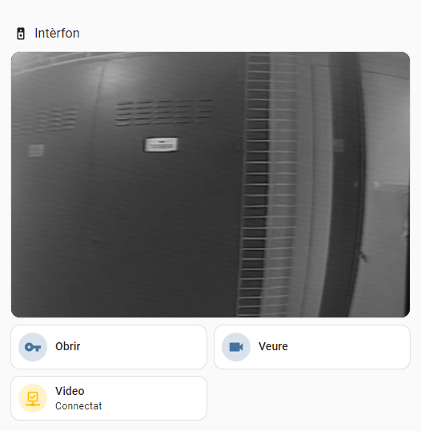

# remoteDoorbell

This repository contains files to remotely control a doorbell system, integrating two-way audio and analog video for enhanced functionality with Home Assistant.

The system is built around a **Raspberry Pi Zero 2W** and a custom external module to convert analog video to UVC, connected via the OTG USB port. The doorbell used for development is the **Monitor Compact Digital** from the Spanish manufacturer **Auta**.

## Features

- **Remote Doorbell Control:** Control the doorbell remotely.
- **2-Way Audio Support:** Communicate through a built-in audio system.
- **Analog Video Integration:** Capture and stream video via an external UVC module.
- **Home Assistant Integration:** Easily integrate with Home Assistant for automation.

## Requirements

- **Raspberry Pi Zero 2W** (or compatible model)
- **Auta Monitor Compact Digital** doorbell
- Home Assistant (for integration)
- Soldering iron, cables, solder, etc.
- External USB module for analog video conversion, such as the EasyCAP available on AliExpress for around €5.
- **DC-DC Buck Converter** (24V to 5V). Something like this:
- **Bidirectional Logic Level Converter**: The smaller, the better, with at least 3 lines needed.
- **MicroUSB to USB converter** (or a male microUSB cable to replace the connector in the capture card).

## Wiring Instructions

### Power Supply (5V)
The Auta doorbell operates on 24V, but its internal 5V line is insufficient to power the Raspberry Pi. Hence, we require a separate DC-DC converter for more efficient power delivery.

Locate the **Vin+** and **Vin-** pins on the converter's PCB:


Make sure to solder the **Vin+** and **EN** pads together to keep the converter always on.

The **Vout+** pin from the converter connects to the Raspberry Pi’s 5V pin. Note that I skipped the ground (Vout-) connection here for space efficiency, as the ground will be shared through the AV signal wires.


### Logic Level Converter
The logic level converter will bridge the 5V inputs/outputs from the doorbell’s microcontroller to the 3.3V GPIOs of the Raspberry Pi. You'll need to connect the following signals:

| Pin Name        | Description               | Pin Number |
|-----------------|---------------------------|------------|
| **VIDEO_SENSOR_PIN** | Video relay signal   | GPIO 26    |
| **VIDEO_BUTTON_PIN** | Video button         | GPIO 17    |
| **DOOR_BUTTON_PIN**  | Doorbell button      | GPIO 22    |

The script by default assumes the pins from the table above.


The wires from the PCB connect to the **HV** pads of the logic level converter, with the corresponding **LV** connections leading to the Raspberry Pi’s GPIO pins.

I wasn’t able to find a dedicated 5V signal triggered by someone ringing the bell, so I’ve opted to use the **video** relay signal instead. This is because the video is activated when the bell rings. Then I just have to discard the case of manually requesting it with the button. If you discover a simpler method with just 2 connections, feel free to share!

### Audio and Video

WIP

## Installation

1. Clone the repository to your Raspberry Pi:
    ```bash
    wget https://github.com/markstor/remoteDoorbell/archive/refs/heads/main.zip
    unzip main.zip
    mv remoteDoorbell-main doorbell
    cd doorbell
    ```
2. Install the required dependencies:
    ```bash
    sudo apt update
    sudo apt install python3-paho-mqtt
    sudo apt install ffmpeg
    ```
1. Stay in the same doorbell directory, and download the latest `go2rtc` release and rename it:
   ```bash
   wget https://github.com/AlexxIT/go2rtc/releases/download/v1.9.7/go2rtc_linux_arm
   mv go2rtc_linux_arm go2rtc
   chmod 755 go2rtc
   ```
3. In your Home Assistant instance install the **Mosquitto** complement and the **MQTT** integration
4. Put your MQTT settings in the `mqtt_config.json` of your Raspberry Pi.
5. Change the paths in the `doorbell.service` file to the real path of your `doorbell` directory. Change also the user and group, they are tipically the same.
6. Set up the systemd service:
    - Copy the `doorbell.service` file to `/etc/systemd/system/`:
        ```bash
        sudo cp doorbell.service /etc/systemd/system/
        ```
    - Reload systemd to recognize the service:
        ```bash
        sudo systemctl daemon-reload
        ```
    - Enable and start the service:
        ```bash
        sudo systemctl enable doorbell.service
        sudo systemctl start doorbell.service
        ```

## Usage

- The `doorbell.service` will now run the Python script automatically in the background.
- To check the status of the service:
    ```bash
    sudo systemctl status doorbell.service
    ```
- You can stop the service anytime with:
    ```bash
    sudo systemctl stop doorbell.service
    ```
- You can check the logs in the journal:
    ```bash
    sudo journalctl -u doorbell
    ```

## Home Assistant configuration
To integrate the doorbell with Home Assistant using WebRTC:

1. Install the **WebRTC** integration from **HACS** (Home Assistant Community Store).
2. In the integration configuration, as go2rtc server add the IP address of your Raspberry Pi.
3. Restart Home Assistant to apply the changes.

Setup a WebRTC card in your favourite dashboard to use 2-way audio:
```yaml
type: custom:webrtc-camera
streams:
  - url: stream
    mode: webrtc
    media: video,audio,microphone
ui: true
muted: false
style: >-
  .mode {display: none} .screenshot {display: none} .pictureinpicture {display:
  none} .fullscreen {display: none}
```

You can add the entities from the MQTT device in the same dashboard to have something like this:



The browser or app should ask you for a microphone access. It only works if you are connected to your Home Assistant through HTTPS. More info about this here: [WebRTC](https://github.com/AlexxIT/WebRTC?tab=readme-ov-file#two-way-audio)

### Notification automatization

We will need to configure a camera entity to generate a cool notification like this one:


This will be easy enough thanks to the Generic Camera integration:

Hass > Settings > Integrations > Add Integration > Generic Camera > Stream Source URL: rtsp://ip.of.your.raspberry:8554/stream (if you changed the stream name in `go2rtc.yaml`, use that instead of `stream`)

Create a notification script like below:

```yaml
alias: Notify doorbell
description: ""
triggers:
  - trigger: state
    entity_id:
      - binary_sensor.video_sensor
    from: "off"
    to: "on"
conditions:
  - condition: template
    value_template: >-
      {{(as_datetime(states.binary_sensor.video_sensor.last_changed) -
      as_datetime(states.button.video_button.state)).total_seconds() > 10 }}
actions:
  - action: notify.your_notify_entity
    metadata: {}
    data:
      title: Truquen! 🏠
      message: 🔔 Han trucat al timbre. Prem per parlar.
      data:
        tag: doorbell
        actions:
          - action: OPEN_DOOR
            title: Obrir la porta
        notification_icon: mdi:doorbell-video
        clickAction: /your/dashboard/url/
        image: /api/camera_proxy/camera.your_entity
  - delay:
      hours: 0
      minutes: 1
      seconds: 30
      milliseconds: 0
  - action: notify.your_notify_entity
    metadata: {}
    data:
      message: clear_notification
      data:
        tag: doorbell
    enabled: true
mode: single
```

If you have an iPhone you are lucky, because you can have a stream video in the notification instead of a snapshot. Google around and modify the `data` section accordingly.

We will need a second script to react to the notification button:

```yaml
alias: Manage doorbell notification
description: ""
triggers:
  - trigger: event
    event_type: mobile_app_notification_action
    event_data:
      tag: doorbell
conditions: []
actions:
  - choose:
      - conditions:
          - condition: template
            value_template: "{{trigger.event.data.action == \"OPEN_DOOR\"}}"
        sequence:
          - action: button.press
            metadata: {}
            data: {}
            target:
              entity_id: button.door_button
          - action: notify.your_entity
            metadata: {}
            data:
              data:
                tag: doorbell
              message: clear_notification
mode: single
```

Pay attention to modify the entity names to your specific case.


